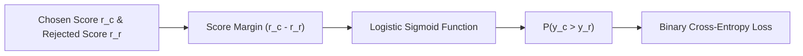

# genpark-pairwise-bradley-terry-reward-model-skill

Bradley-Terry preference model implementation calculating logistic choice likelihoods, negative log-likelihood loss, and analytical gradient updates.

## Architecture

## Features
- **Analytical Gradient Step**: Computes exact single-step reward shift.
- **Zero Dependencies**: 100% Python Standard Library.
